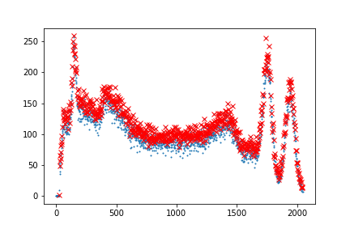
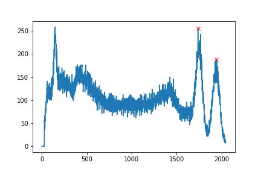
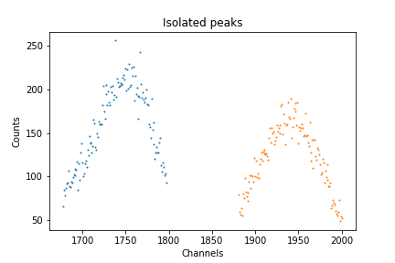
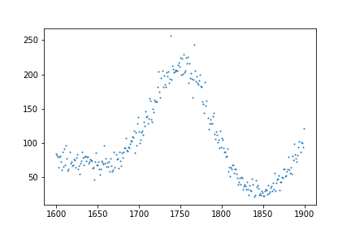

# Initial Data Plotting
For this section, let's first see the entire process for selecting out the data for a single file so that the method can be applied to all of our data. Just as an example, I'll be demonstrating the process using the `Co60.csv` file, which you may be able to guess contains a sample of Cobalt-60.

Before we can get started plotting our data, we'll want to import the modules which we will use. In the first cell of your Jupyter Notebook, add the import statements:
```python
import pandas as pd
import matplotlib.pyplot as plt
import numpy as np
from scipy.optimize import curve_fit
from scipy.signal import find_peaks
from scipy.stats import linregress, chi2
```
Before plotting, we'll also want to inspect our `.csv` files to see which rows and columns we're able to use. Here's what the first several lines of the file `Co60.csv` contain:


As you can see here, rows 1 through 18 contain data related to the program settings when the data was collected, such as the voltage, fine and coarse grain values, the time and date that the data was collected, and so on. It isn't until row 23 that we start getting actual data points, with row 22 telling us the column names. We can also see that only the first and third columns (Channel & Counts) contain data, with the second column (Energy) being empty. These facts hold true across all of our files, so we can skip the same initial rows and only use the same columns across all of our data.

For much of our data, it will also be easier to find our peaks if we set the y-axis to a logarithmic scale instead of a linear one. Let's get started by creating a method which will load and plot our data when given a file path, and which will also have an option to allow us to control how the y-axis is scaled:
```python
def plot_data(isotope, y_log=True):
    data = pd.read_csv(f'raw-data/{isotope}.csv', skiprows=21, usecols=[0,2])
    # Assign axes and names
    x_axis = data.iloc[:,0]
    x_name = data.columns[0]
    
    y_axis = data.iloc[:,1]
    y_name = data.columns[1]

    # Create plot
    plt.scatter(x_axis, y_axis, s=1)
    plt.xlabel(x_name)
    plt.ylabel(y_name)
    plt.title(f"{isotope} raw data")
    plt.savefig(f"{isotope}_raw_data.png")
    if y_log:
        plt.yscale('log')
    plt.show()

    return data
```
This function only requires the name of the file before the file extension in order to create a plot of the recorded data. If `y_log` isn't specified, it will default to `True`:
```python
plot_data("Co60", y_log=True)
```
**Output:**


## Interpreting the Plot
In order to properly calibrate our data, it's necessary that we fully understand what the raw data is telling us. In this case, we should know beforehand that Cobalt-60 has two peak emission spectra: one at **1.175 MeV**, and another at **1.333 MeV**. However, in this plot, there appear to be **at least** 3 separate peaks: 1 on the far left of the plot, and 2 on the far right of the plot. As well as those more obvious peaks, we also have 2 bumps which could possibly be considered minor peaks between them. So, how do we know which ones to consider when we begin isolating our peaks? In this case, we have to know what shapes we should expect from gamma spectroscopy data.

### Compton Scattering
In gamma spectroscopy, not every emitted photon deposits its full energy directly into the detector. As mentioned previously, the scintillator steps down the photon energies in a process known as **Compton scattering**, where a photon transfers its energy to a series of electrons. In this process, it is possible for only a fraction of the photon's energy to be absorbed by the electron it's incident upon, with the total deposited energy being reliant on the scattering angle. Between the leftmost and rightmost peaks in the plot, you can see a gently sloping distribution with the extrema defined by the two bumps/minor peaks. This is known as the **Compton plateau** or **Compton continuum**.

The upper limit of partial energy deposition forms what's called the **Compton edge** (or **Compton cliff**): a relatively sharp drop at the high-energy end of the Compton continuum. In the plot for Cobalt-60, this can be seen just before the peaks on the right hand side. The energy of this edge corresponds to the maximum energy that a photon can transfer in a single Compton scattering event, which occurs when the photon enters the detector and deposits a significant portion of its energy before being reflected $180^\circ$. The smaller "bumps" before the main peaks are not true photopeaks, but part of the Compton scattering pattern.

Meanwhile, the **far-left** peak is most likely the result of backscatter radiation. Backscatter peaks arise when gamma photons scatter off of nearby objects, such as walls, the table, or the radiation shielding, before they re-enter the detector with significantly reduced energy. These photons can produce a distinct peak at lower channels, to the left of the main Compton continuum. 

It is also possible for the lower energy peaks to occur as a result of the detector material. When an incoming gamma photon ejects an inner shell electron in the scintillator, it will emit a characteristic X-ray depending on what it's made out of, NaI in the case of this experiment. This is called an **X-ray escape peak**. 

This gives our low energy peak two possible explanations: either it is backscatter radiation, or it is an escape peak emitted by our NaI detector. These explanations don't have to be mutually exclusive either - it's possible that both features occur at the same or overlapping energies.

It's important to understand that the Compton edge only shows the maximum for **partial energy loss**, not the **maximum possible energy** that can be detected. Past the edge, a photon gets closer to being fully absorbed by the scintillator, meaning everything before the furthest right peaks represents events where the photon is at least partially reflected out of the detector, and the centers of the peaks represent where most or all of the photon's energy is absorbed by the scintillator and passed on to the PMT. Every true photopeak should be preceded by a Compton continuum and edge. As our photopeaks are so near each other in our Co-60 data, their respective Compton features overlap.

Altogether, this plot shows:

* A backscatter reflective peak and/or an X-ray escape peak on the far left,

* A Compton continuum in the mid range,

* A Compton edge before the first photopeak,

* And finally, the two true photopeaks of Cobalt-60 on the far right.

Now that we understand the features of our plot, let's move forward to selecting the data from our peaks.

# Selecting the Photopeaks
There are two main methods that can be used to find our peaks: 

1. Using the `find_peaks` module in `scipy`

2. Visually inspecting the data.

Before attempting either of these methods, let's edit our `plot_data` function to return the `data` variable so that it can be saved and used elsewhere. At the end of the function, simply add `return data`. Then, when you call the function, you can set `data` to a new variable, turning our function call into:
```python
Co_60 = plot_data("Co60.csv", y_log=True)
```
Now we can use the `Co_60` variable to find our peaks. Let's look at the process for using `find_peaks` first.

## `find_peaks`
In order to find our peaks with this method, we'll first want to assign  `Co_60`'s x- and y-axes to variables so that we can plot them against what `find_peaks` returns as a comparison. The result that we're looking for is to have one selected point at the top of our two right peaks.

The `find_peaks` module can take as optional parameters: `height`, `threshold`, `distance`, `prominence`, `width`, `wlen`, `rel_height`, and `plateu_size`. Locating the peaks will require careful manipulation of these values in order to exclude noise and data that isn't the peaks. For more complete descriptions of these parameters, [click here to go to the official documentation.](https://docs.scipy.org/doc/scipy/reference/generated/scipy.signal.find_peaks.html)

Without assigning any of these parameters a value, `find_peaks` selects indices in the data that are preceded by and followed by smaller values. It returns them along with a dictionary which contains the values **it calculates** for the optional parameters (heights, thresholds, prominences, etc). If your data is somehow perfectly smooth and noiseless, then no further steps would be required. To show what this looks like when used with our noisy sample, let's plot our data underneath the found peaks without first trying to filter for certain parameters:
```python
x_values = Co_60.iloc[:,0]
y_values = Co_60.iloc[:,1]
# Find peaks
peaks, _ = find_peaks(y_values)
# Plot data
plt.scatter(x_values, y_values, s=1)
# Plot peaks
plt.plot(peaks, y_values[peaks], 'x', color='red')
plt.show()
```
**Output:**



Each one of the plotted 'x's here is being counted as another individual 'peak'. So, to narrow down our choices, let's start trying to estimate the parameters. Let's try adjusting `distance`, `prominence`, and `width`. The distance argument sets the minimum distance that should exist between two peaks. The `prominence` argument measures the vertical distance between the top of the peak and the lowest contour line that doesn't enclose a higher peak (as opposed to `height` which measures the distance from the top of the peak to y=0). The width argument measures the horizontal span of a single peak. 

You are encouraged to attempt to solve for some appropriate values for these parameters here.

<details>
<summary>Show solution</summary>
<p>

If we provide an estimate for these values at `150`, `100`, and `60` respectively, we'll be able to select out the two peaks we want:

```python
x_values = Co_60.iloc[:,0]
y_values = Co_60.iloc[:,1]
peaks, _ = find_peaks(y_values, distance=150, prominence=100, width=60)
plt.plot(x_values, y_values)
plt.plot(peaks, y_values[peaks], 'x', color='red')
plt.show()
```


</p>
</details>

After finding the appropriate parameters, your results should look similar to the following:



Now, we'll have to save the data around the peaks. This can be done with a `for loop` where we select a number of points on either side of the peak, extract that portion of the dataset, and store it for later use. We'll also include safeguards to ensure we don't go outside of the bounds of the data:
```python
peak_ranges = []
for peak in peaks:
    left=max(0, peak-60)
    right=min(len(y_values)-1, peak + 60)
    peak_ranges.append(Co_60.iloc[left:right].copy())
```
Each entry in `peak_ranges` now holds a slice of copied data centered around one of the detected peaks. We can plot each of these slices to visually confirm that the correct regions were captured:
```python
for peak in peak_ranges:
    plt.scatter(peak.iloc[:,0], peak.iloc[:,1], s=1)
plt.title('Isolated peaks')
plt.xlabel('Channels')
plt.ylabel('Counts')
plt.show()
```
**Output:**



This also highlights one of the shortcomings of the `find_peaks` function. As we can see with the peak on the left, our selection won't necessarily be centered. It found the highest point in the left peak, which happens to be an outlier in the data, and assumes that this point is the center of the peak.

You could then set each peak to a new variable so that it can be used in the next section by using:
```python
Co_60P1 = peak_ranges[0]
Co_60P2 = peak_ranges[1]
```
While `find_peaks` is generally very powerful, it requires careful tuning of multiple parameters. It is also possible to run into plots where the peaks that you see can't easily be distinguished from noise using this module, or where it is impossible to set the parameters so as to include all peaks, such as when two peaks overlap with each other while others are distinct. There are work arounds for these issues, such as using multiple instances of `find_peaks` to select peaks with different parameters in the same data, but it may be better to use another method for isolating your peaks depending on which problems you're running into.

## Visual inspection
While it may not be programmatically optimized, one of the easier ways to isolate peaks is by eye: simply estimate where the boundaries of the peaks are and use those numbers to splice the plot. If it's off - adjust your numbers until the peaks are as close to centered as you can get them. If you plot your estimates as you go, you will also be contracting what's shown of the x-axis, providing you with new tick marks with less distance between them, allowing you to splice again more accurately.

Let's try:
```python
Co_60P1 = Co_60.iloc[1600:1900].copy()
plt.scatter(co_peak_one.columns[0], co_peak_one.columns[1], s=1)
plt.show()
```
**Output:**



This isn't perfect, but makes it easier to find the appropriate limits. To center the peak, let's use the data range [1680:1815]:


Nice! Now we can use the same process to isolate our second peak, giving us:
```python
Co_60P2 = Co_60.iloc[1850:2025].copy()
plt.scatter(Co_60P2.iloc[:,0], Co_60P2.iloc[:,1], s=1)
plt.show()
```
**Output:**


---

Now that we have our first peaks isolated, [click here to continue on to the next section](04_fitting_curves.md) where we'll learn how to fit our data to an equation.