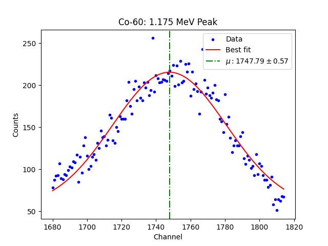
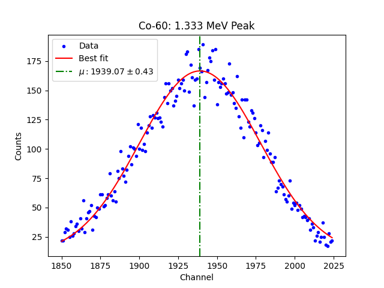

# `curve_fit`
The parameters that `curve_fit` works from are given by the [official documentation](https://docs.scipy.org/doc/scipy/reference/generated/scipy.optimize.curve_fit.html) as: `f`, `xdata`, `ydata`, `p0`, `sigma`, `absolute_sigma`, `check_finite`, `bounds`, `method`, `jac`, `full_output`, `nan_policy`, and `**kwargs`. Only the first three parameters are required: `f`, `xdata`, and `ydata`, but including the fourth, `p0`, is often essential for guiding the fit, especially when the function is nonlinear or has multiple parameters. `p0` defaults to all ones if not specified, but this often fails for more complex models. 

Only these four will be covered here, but feel free to explore the documentation provided if you wish to use everything that `curve_fit` has to offer.

Here, `f` is our model function. This requires the creation of another function which will be called in `curve_fit`. It is necessary that the first argument that this function takes is the independent variable, which is the x-axis in the case of our data. The other parameters of this function will be the remaining unknown variables of the equation. 

`xdata`, and `ydata` are exactly what they sound like: the data that you're fitting to the model function.

`p0` is the initial guess for the unknown variables/parameters of the model function. It is given as an **array** where every guess is listed in the order that their associated parameters are listed in the function definition (i.e. if the function is: `def function(x, a, b)`, `p0` would be `[a_estimate, b_estimate]`). 

Let's get started on creating our model function.
# The Gaussian
The **Gaussian** (or **Normal**) **Distribution** is a common equation that you'll run into in statistical mechanics. It describes a symmetric, bell-shaped curve centered at a mean value, $\mu$ (mu), with its width determined by the standard deviation, $\sigma$ (sigma), and its offset above the x-axis given by **D** (called the y-offset). It has the form:

$$f(x)=\frac{1}{\sqrt{2\pi \sigma^2}}e^{-\frac{(x-\mu)^2}{2\sigma^2}}+D$$

In gamma spectroscopy, we are using the Gaussian as a model for how our detected energy counts are spread around the central photopeak. Variations in the emission and detection of our photons have caused the recorded values to "smear" into a normal distribution, with the most common value being the center of the curve. Fitting our data to this curve then allows us to extract the value for the central energy, $\mu$, as well as its margin of error.

In our equation, the first term ($\frac{1}{\sqrt{2\pi \sigma^2}}$) is called the **normalization constant**. Its purpose is to set the value of the integral of our curve to be equal to 1, meaning 100% of the data fits under the curve, but this term can actually be dropped for our purposes. We can thus set our equation to be equal to:

$$f(x)=A \cdot e^{-\frac{(x-\mu)^2}{2\sigma^2}}+D$$

In this equation:

* A controls the **height**/**amplitude** of the peak

* $\mu$ is the **mean value** in the **center** (the energy of the photon)

* $\sigma$ relates to the standard deviation/**thickness** of the "line"

* D is the y-offset.

Let's create a `gaussian` function which simply returns our equation $f(x)$:
```python
def gaussian(x, amplitude, mu, sigma, y_offset):
    return amplitude * np.exp(-((x-mu)**2) / (2 * sigma**2)) + y_offset
```
Additionally, our data will include some peaks which are so close to each other that they actually **overlap**. Overlapping peaks are common when two gamma emissions have close energies. This can be modelled using the equation:

$$f(x)=A_1 \cdot e^{-\frac{(x-\mu_1)^2}{2\sigma^2_1}}+A_2 \cdot e^{-\frac{(x-\mu_2)^2}{2\sigma^2_2}}+...+A_n \cdot e^{-\frac{(x-\mu_n)^2}{2\sigma^2_n}}+D$$

Where `n` is given by the number of overlapping peaks. Luckily, our data shouldn't include more than two overlapping peaks, so we can create the second function as:
```python
def double_gaussian(x, amp_1, mu_1, sigma_1, amp_2, mu_2, sigma_2, y_offset):
    return (
        amp_1 * np.exp(-((x-mu_1)**2) / (2 * sigma_1)**2) 
        + (amp_2 * np.exp(-((x-mu_2)**2) / (2 * sigma_2)**2)) 
        + y_offset
    )
```
# Using `curve_fit`
Now we can **finally** use `curve_fit` to start extracting values from our data. `curve_fit` can return five different values, `popt`, `pcov`, `infodict`, `mesg`, and `ier`, but only the first two are valuable for our purposes. `popt` is a one dimensional array containing the optimal parameter values, while `pcov` contains a 2-D array with the approximate covariance of `popt`. For the uncertainties, only the square roots of the diagonal values of `pcov` is needed.

Let's create a function for each of our gaussian functions which will return `popt` and `pcov`. The only difference between these functions will be which equation they call to fit to.
```python
def find_gaussian_values(xdata, ydata, p0):
    return curve_fit(gaussian, xdata, ydata, p0=p0)

def find_dgaussian_values(xdata, ydata, p0):
    return curve_fit(double_gaussian, xdata, ydata, p0=p0)
```
Next, let's create a function which will take our `popt` and `pcov` arrays and use them to create a plot of our data against the **line of best fit**. It will be able to take an element name and our emission value in order to title each plot. We can also make it capable of plotting either a gaussian or a double gaussian with a simple `True`/`False` flag, and then using an `if`/`else` tree to differentiate between the two. It will also print out the found parameters and their uncertainties, as well as return our $\mu$ values and their uncertainties so they can be saved and used later:
```python
def plot_best_fit(element, emission_peak, xdata, ydata, popt, pcov, d_gaussian=False):
    uncertainties = np.sqrt(np.diag(pcov))
    if not d_gaussian:
        labels = ['Amplitude', 'Mean', 'Sigma', 'Y-offset']
    else:
        labels = ['Amplitude 1', 'Mean 1', 'Sigma 1', 
                  'Amplitude 2', 'Mean 2', 'Sigma 2',
                  'Y-offset']
    if not d_gaussian:
        mu = popt[1]
        mu_uncertainty = uncertainties[1]
    else:
        mu_1, mu_2 = popt[1], popt[4]
        mu_1_uncertainty, mu_2_uncertainty = uncertainties[1], uncertainties[4]

    plt.scatter(xdata, ydata, label='Data', marker='.', color='blue')
    if not d_gaussian:
        plt.plot(xdata, gaussian(xdata, *popt), label='Best fit', color='red')
        plt.axvline(mu, color='green', linestyle='-.', label=f'$\mu: {mu:.2f}\pm{mu_uncertainty:.2f}$')
    else:
        plt.plot(xdata, double_gaussian(xdata, *popt), label='Best fit', color='red')
        plt.axvline(mu_1, color='green', linestyle='-.', label=f'$\mu_1: {mu_1:.2f}\pm{mu_1_uncertainty:.2f}$')
        plt.axvline(mu_2, color='black', linestyle='-.', label=f'$\mu_2: {mu_2:.2f}\pm{mu_2_uncertainty:.2f}$')
    
    plt.title(f'{element}: {emission_peak} Peak')
    plt.xlabel('Channel')
    plt.ylabel('Counts')
    plt.legend()
    plt.show()

    print('Best fit parameters:')
    for name, val, err in zip(labels, popt, uncertainties):
        print(f'{name}: {val:.2f} +/- {err:.2f}')
    
    if not d_gaussian:
        return mu, mu_uncertainty
    else:
        return mu_1, mu_1_uncertainty, mu_2, mu_2_uncertainty
```
With these functions, we can now run our first `curve_fit`:
```python
p0=[175, 1750, 20, 50]

Co_60P1_popt, Co_60P1_pcov = find_gaussian_values(
    co_peak_one.iloc[:,0].values, 
    co_peak_one.iloc[:,1].values, 
    p0
    )

Co_60P1_mu, Co_60P1_mu_uncert = plot_best_fit(
    'Co-60', '1.175 MeV',
    co_peak_one.iloc[:,0].values, co_peak_one.iloc[:,1].values, 
    Co_60P1_popt, Co_60P1_pcov
    )
```
**Output:**



```python
Best fit parameters:
Amplitude: 160.75 +/- 8.62
Mean: 1747.79 +/- 0.57
Sigma: 33.09 +/- 2.04
Y-offset: 54.67 +/- 9.43
```
And for our second peak:
```python
p0=[150, 1940, 30, 25]

Co_60P2_popt, Co_60P2_pcov = find_gaussian_values(
    co_peak_two.iloc[:,0].values, 
    co_peak_two.iloc[:,1].values, 
    p0
    )

Co_60P2_mu, Co_60P2_mu_uncert = plot_best_fit(
    'Co-60', '1.333 MeV',
    co_peak_two.iloc[:,0].values, co_peak_two.iloc[:,1].values, 
    Co_60P2_popt, Co_60P2_pcov
    )
```
**Output:**



```python
Best fit parameters:
Amplitude: 156.96 +/- 3.83
Mean: 1939.07 +/- 0.43
Sigma: 39.02 +/- 1.22
Y-offset: 9.62 +/- 4.18
```
Awesome! You've completed your first `curve_fit` and have found the numbers which we can later associate with the radiation energies. This process has also resulted in us setting the variables `Co_60P1_mu`, `Co_60P1_mu_uncert`, `Co_60P2_mu`, and `Co_60P2_mu_uncert`. 

In order to make our work easier later, let's create a new cell at the bottom of our notebook which we'll use to keep a dictionary of all of our elements, their calculated channel numbers and uncertainties, and their associated emission energies (in keV):
```python
value_bank = {
    ('Co-60', Co_60P1_mu, Co_60P1_mu_uncert, 1175),
    ('Co-60', Co_60P2_mu, Co_60P2_mu_uncert, 1333),
}
```
This is where you'll store variables for each of the remaining files emission peaks, which will be used in the next section. For reference (if you're interested in attempting to find peak fits before continuing to the next section), here is a table with the provided isotopes and the known emission energies of their photopeaks:
|Isotope | Energy (keV)                     |
|--------|----------------------------------|
|Na-22   |511, 1274.54                      |
|Mn-54   |834.84                            |
|Co-57   |122.06                            |
|Co-60   |1173.23, 1332.49                  |
|Cd-109  |88.03                             |
|Ba-133  |81, 276.4, 302.85, 356.01, 383.85 |

---

After we have performed this process for the remaining files, we'll have successfully extracted the mean channel numbers ($\mu$) for every detected emission peak. From there, we can begin the process of fitting our data to a straight line. [Click here to continue to the next section](05_linregress.md) where we will look at how to plot all of our data as well as label it and include our margins of error.