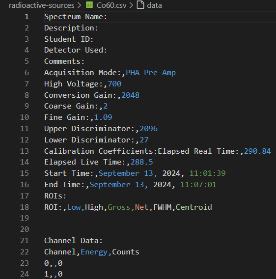
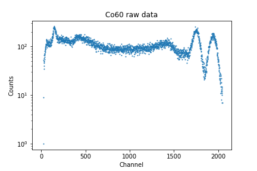
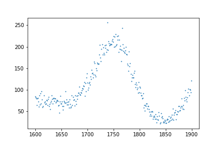
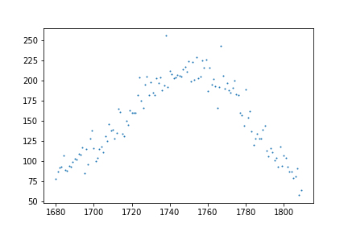
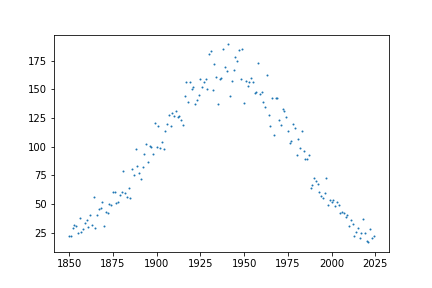

# Initial Data Plotting
For this section, let's first see the entire process for selecting out the data for a single file so that it can be generalized and applied to all of our data. Just as an example, I'll be demonstrating the process using the `Co60.csv` file.

Before we can get started plotting our data, we'll want to import the modules which will be used. In the first cell of your Jupyter Notebook, add the import statements:
```python
import pandas as pd
import matplotlib.pyplot as plt
import numpy as np
from scipy.optimize import curve_fit
```
As a last step before plotting, we'll want to inspect our `.csv` files to see which rows and columns we're able to use. Here's what the first several lines of the file `Co60.csv` contain:



As you can see here, rows 1 through 18 contain extraneous data related to the program settings when the data was collected, such as the voltage, fine and coarse grain, the time and wate that the data was collected, and so on. It isn't until row 23 that we start getting actual data points, with row 22 telling us the column names. We can also see that only the first and last columns (Channel & Counts) contain data, with the middle column (Energy) being empty. These facts hold true across all of our files, so we can skip the same rows and only use the same columns across all of our data.

For much of our data, it will also be easier to find our peaks if we set the y-axis to use a logarithmic scale. Let's get started by creating a method which will load and plot our data when given the file path, and which will also have an option to allow us to control how the y-axis is scaled:
```python
def plot_data(filepath, y_log=True):
    data = pd.read_csv(filepath, skiprows=21, usecols=[0,2])
    # Remove "raw-data/" and ".csv" for naming
    filename = filepath[9:-4]
    x_axis = data.iloc[:,0]
    x_name = data.columns[0]

    y_axis = data.iloc[:,1]
    y_name = data.columns[1]

    # Create plot
    plt.scatter(x_axis, y_axis, s=1)
    plt.xlabel(x_name)
    plt.ylabel(y_name)
    plt.title(f"{filename} raw data")
    plt.savefig(f"{filename}_raw_data.png")
    if y_log:
        plt.yscale('log')
    plt.show()
```
You can then use this method along with a filepath to create a plot of the recorded data:
```python
plot_data("raw-data/Co60.csv", y_log=True)
```
**Output:**



## Interpretting the Plot
In order to properly calibrate our data, it's necessary that we fully understand what the raw data is telling us. In this case, it's important to know first that Cobalt-60 has two peak emission spectra: one at **1.175 MeV**, and another at **1.333 MeV**. However, in this plot, there appear to be **at least** 3 separate peaks: 1 on the far left, and 2 on the far right of the plot, and 2 bumps which could be considered peaks between them. So, how do we know which ones to consider?

### Compton Scattering
In gamma spectrscopy, not every gamma photon deposits its full energy into the detector. As mentioned previously, the scintillator steps down the photon energies in a process known as **Compton scattering**, where the photon transfers its energy to an electron. In this process, it is possible for only a fraction of the photon's energy to be absorbed by the electron it's incident upon depending on the scattering angle.Between the leftmost and rightmost peaks in the plot, you can see a gently sloping distribution. This is known as the **Compton plateau** or **Compton continuum**.

That upper limit forms what's called the **Compton edge** (or **Compton cliff**): a relatively sharp drop at the high-energy end of the Compton continuum. In the plot for Cobalt-60, this can be seen just before the peaks on the right hand side. The energy of this edge corresponds to the maximum energy that a photon can transfer in a single Compton scattering event, which occurs when it's backscattered $180^\circ$ - when the photon goes straight up in the detector, deposits a majority of its energy, and is then reflected directly away. The smaller "bumps" before the main peaks are not true photopeaks, but part of the backscatter pattern.

The **far-left** peak is most likely the result of backscatter radiation as well. Backscatter peaks arise when gamma photons scatter off of nearby objects, such as the detector housing or lab walls, and then re-enter the detector with significantly reduced energy. These photons can produce a small but distinct peak at lower channels, well below the main Compton continuum. 

It's important to understand that the Compton edge only shows the maximum for **partial energy loss**, not the **maximum possible energy** that can be detected. Past the edge, a photon gets closer to being fully absorbed by the scintillator, meaning everything before the furthest right peaks represents events where the photon is at least partially reflected out of the detector, and the centers of the peaks represent where all of the photon's energy is absorbed by the scintillator and passed on to the PMT. Every true photopeak should be preceeded by a Compton continuum and edge. As our photopeaks are so near each other in our Co60 data, their respective Compton features overlap.

Altogether, this plot shows:

* A backscatter reflective peak on the far left,

* A Compton continuum in the mid range,

* A Compton edge before the two peaks on the right,

* And finally, the two true photopeaks of Cobalt-60 on the far right.

Now that we understand the features of our plot, let's move forward to isolating our peaks.
# Isolating the Photopeaks
For this particular experiment, isolating our peaks before doing our curve fits will represent some of the more tedious work. While it may not be programmatically optimized, the easiest way to isolate these peaks is by eye: estimate where the ends of the peaks are and use those numbers to splice the plot. If it's off - adjust your numbers until the peaks are as close to centered as you can get them.

In order to do this, let's edit our `plot_data` function to return the data so that we can manipulate it elsewhere. At the end of the function, simply add `return data`, then when you call the function, you can set `data` to a new variable. Now, we can use:
```python
cobalt = plot_data("raw-data/Co60.csv", y_log=True)
```
And manipulate the `cobalt` variable to find our peaks. We can do this using the `iloc` and `copy` functions. Let's try:
```python
co_peak_one = cobalt.iloc[1600:1900].copy()
plt.scatter(co_peak_one.columns[0], co_peak_one.columns[1], s=1)
plt.show()
```
**Output:**



This isn't perfect, but makes it easier to find the appropriate limits. To center the peak, let's use the data range [1680:1810]:



Nice! Now we can use the same process to isolate our second peak, giving us:
```python
co_peak_two = cobalt.iloc[1850:2025].copy()
plt.scatter(co_peak_two.iloc[:,0], co_peak_two.iloc[:,1], s=1)
plt.show()
```
**Output:**



---

Now that we have our first peaks isolated, [click here to continue on to the next section](05_fitting_curves.md) where we'll learn how to fit our data to curves.