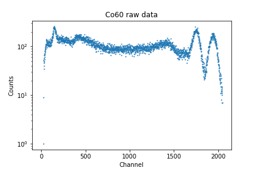

# Initial Data Plotting
For this section, let's first see the entire process for selecting out the data for a single file so that it can be generalized and applied to all of our data. Just as an example, I'll be demonstrating the process using the `Co60.csv` file.

Before we can get started plotting our data, we'll want to import the modules which will be used. In the first cell of your Jupyter Notebook, add the import statements:
```python
import pandas as pd
import matplotlib.pyplot as plt
import numpy as np
from scipy.optimize import curve_fit
from scipy.signal import find_peaks
```
As a last step before plotting, we'll want to inspect our `.csv` files to see which rows and columns we're able to use. Here's what the first several lines of the file `Co60.csv` contain:


As you can see here, rows 1 through 18 contain extraneous data related to the program settings when the data was collected, such as the voltage, fine and coarse grain values, the time and date that the data was collected, and so on. It isn't until row 23 that we start getting actual data points, with row 22 telling us the column names. We can also see that only the first and third columns (Channel & Counts) contain data, with the second column (Energy) being empty. These facts hold true across all of our files, so we can skip the same rows and only use the same columns across all of our data.

For much of our data, it will also be easier to find our peaks if we set the y-axis to use a logarithmic scale. Let's get started by creating a method which will load and plot our data when given the file path, and which will also have an option to allow us to control how the y-axis is scaled:
```python
def plot_data(filepath, y_log=True):
    data = pd.read_csv(filepath, skiprows=21, usecols=[0,2])
    # Remove "raw-data/" and ".csv" for naming
    filename = filepath[9:-4]
    # Assign axes and names
    x_axis = data.iloc[:,0]
    x_name = data.columns[0]

    y_axis = data.iloc[:,1]
    y_name = data.columns[1]

    # Create plot
    plt.scatter(x_axis, y_axis, s=1)
    plt.xlabel(x_name)
    plt.ylabel(y_name)
    plt.title(f"{filename} raw data")
    plt.savefig(f"{filename}_raw_data.png")
    if y_log:
        plt.yscale('log')
    plt.show()
```
You can then use this method along with a filepath to create a plot of the recorded data:
```python
plot_data("raw-data/Co60.csv", y_log=True)
```
**Output:**



## Interpretting the Plot
In order to properly calibrate our data, it's necessary that we fully understand what the raw data is telling us. In this case, it's important to know first that Cobalt-60 has two peak emission spectra: one at **1.175 MeV**, and another at **1.333 MeV**. However, in this plot, there appear to be **at least** 3 separate peaks: 1 on the far left, and 2 on the far right of the plot, and 2 bumps which could possibly be considered peaks between them. So, how do we know which ones to consider?

### Compton Scattering
In gamma spectrscopy, not every gamma photon deposits its full energy into the detector. As mentioned previously, the scintillator steps down the photon energies in a process known as **Compton scattering**, where the photon transfers its energy to an electron. In this process, it is possible for only a fraction of the photon's energy to be absorbed by the electron it's incident upon, with the total deposited energy being reliant on the scattering angle. Between the leftmost and rightmost peaks in the plot, you can see a gently sloping distribution. This is known as the **Compton plateau** or **Compton continuum**.

The upper limit of partial energy deposition forms what's called the **Compton edge** (or **Compton cliff**): a relatively sharp drop at the high-energy end of the Compton continuum. In the plot for Cobalt-60, this can be seen just before the peaks on the right hand side. The energy of this edge corresponds to the maximum energy that a photon can transfer in a single Compton scattering event, which occurs when it's backscattered $180^\circ$ - when the photon goes straight up in the detector, deposits a significant fraction of its energy, and is then reflected directly away. The smaller "bumps" before the main peaks are not true photopeaks, but part of the backscatter pattern.

The **far-left** peak is most likely the result of backscatter radiation as well. Backscatter peaks arise when gamma photons scatter off of nearby objects, such as the detector housing or lab walls, and then re-enter the detector with significantly reduced energy. These photons can produce a small but distinct peak at lower channels, well below the main Compton continuum. 

It's important to understand that the Compton edge only shows the maximum for **partial energy loss**, not the **maximum possible energy** that can be detected. Past the edge, a photon gets closer to being fully absorbed by the scintillator, meaning everything before the furthest right peaks represents events where the photon is at least partially reflected out of the detector, and the centers of the peaks represent where all of the photon's energy is absorbed by the scintillator and passed on to the PMT. Every true photopeak should be preceeded by a Compton continuum and edge. As our photopeaks are so near each other in our Co-60 data, their respective Compton features overlap.

Altogether, this plot shows:

* A backscatter reflective peak on the far left,

* A Compton continuum in the mid range,

* A Compton edge before the two peaks on the right,

* And finally, the two true photopeaks of Cobalt-60 on the far right.

Now that we understand the features of our plot, let's move forward to isolating our peaks.
# Isolating the Photopeaks
There are two main methods that can be used to find our peaks: 

1. Using the `find_peaks` module

2. Visually inspecting the data.

Before attempting either of these methods, let's edit our `plot_data` function to return the `data` variable so that we can manipulate it elsewhere. At the end of the function, simply add `return data`. Then, when you call the function, you can set `data` to a new variable, turning our function call into:
```python
cobalt = plot_data("raw-data/Co60.csv", y_log=True)
```
Now we can use the `cobalt` variable to find our peaks. Let's start by demonstrating how to use `find_peaks`.
## `find_peaks`
In order to automatically find our peaks, we'll first want to assign  `cobalt`'s x- and y-axes to variables so that we can plot them again along with our peaks. The result that we're looking for is to have one selected point at the top of our two right peaks.

The `find_peaks` module can take as optional parameters: height, threshold, distance, prominence, width, wlen, rel_height, and plateu_size. Locating the peaks will require careful manipulation of these values in order to exclude noise. For more complete descriptions of these parameters, [click here to go to the official documentation.](https://docs.scipy.org/doc/scipy/reference/generated/scipy.signal.find_peaks.html)

Without assigning any of these parameters a value, `find_peaks` selects indices in the data that are preceeded by and followed by smaller values. It returns them along with a dictionary which contains the values **it calculated** for the optional parameters (heights, thresholds, prominences, etc). To show what this looks like, let's plot our data without first trying to optimize to find our peaks:
```python
x_values = cobalt.iloc[:,0] # Select first column
y_values = cobalt.iloc[:,1] # Select second column
peaks, properties = find_peaks(y_values)
plt.scatter(x_values, y_values, s=1)
plt.plot(peaks, y_values[peaks], 'x', color='red')
plt.show()
```
**Output:**


Each one of the plotted 'x's is being counted as a 'peak'. So, to narrow down our choices, let's start trying to estimate the other arguments. Let's try adjusting `distance`, `prominence`, and `width`. The distance argument sets the minimum distance that should exist between two peaks. The prominence argument measures the vertical distance between the top of the peak and the lowest contour line that doesn't enclose a higher peak (as opposed to height which measures the distance from the top of the peak to y=0). The width argument measures the horizontal span of a single peak. Let's estimate these values at `150`, `100`, and `60` respectively:
```python
x_values = cobalt.iloc[:,0]
y_values = cobalt.iloc[:,1]
peaks, _ = find_peaks(y_values, distance=150, prominence=100, width=60)
plt.plot(x_values, y_values)
plt.plot(peaks, y_values[peaks], 'x', color='red')
plt.show()
```
**Output:**


Now, we'll have to save the data around the peaks. This can be done with a for loop where we select a number of points on either side of the peak, extract that portion of the dataset, and store it for later use. We'll also include safeguards to ensure we don't go outside of the bounds of the data:
```python
peak_ranges = []
for peak in peaks:
    left=max(0, peak-60)
    right=min(len(y_values)-1, peak + 60)
    peak_ranges.append(cobalt.iloc[left:right].copy())
```
Each entry in `peak_ranges` now holds a slice of data centered around one of the detected peaks. We can plot each of these slices to visually confirm that the correct regions were captured:
```python
for peak in peak_ranges:
    plt.scatter(peak.iloc[:,0], peak.iloc[:,1], s=1)
plt.title('Isolated peaks')
plt.xlabel('Channels')
plt.ylabel('Counts')
plt.show()
```
**Output:**


You could then set each peak to a new variable so that it can be used in the next section by using:
```python
co_peak_one = peak_ranges[0]
co_peak_two = peak_ranges[1]
```
While `find_peaks` is generally very powerful, it requires careful tuning of multiple parameters. It is also possible to run into plots where the peaks that you see can't easily be distinguished from noise using this module, or where it is impossible to set the parameters to include all peaks, such as when two peaks overlap with each other while others are distinct. For these instances, it may be better to use another method for isolating your peaks.
## Visual inspection
While it may not be programmatically optimized, one of the easier ways to isolate peaks is by eye: simply estimate where the boundaries of the peaks are and use those numbers to splice the plot. If it's off - adjust your numbers until the peaks are as close to centered as you can get them. If you plot your estimates as you go, you will also be contracting what's shown of the x-axis, providing you with new tick marks which can help you splice more accurately.

Let's try:
```python
co_peak_one = cobalt.iloc[1600:1900].copy()
plt.scatter(co_peak_one.columns[0], co_peak_one.columns[1], s=1)
plt.show()
```
**Output:**


This isn't perfect, but makes it easier to find the appropriate limits. To center the peak, let's use the data range [1680:1815]:


Nice! Now we can use the same process to isolate our second peak, giving us:
```python
co_peak_two = cobalt.iloc[1850:2025].copy()
plt.scatter(co_peak_two.iloc[:,0], co_peak_two.iloc[:,1], s=1)
plt.show()
```
**Output:**


---

Now that we have our first peaks isolated, [click here to continue on to the next section](05_fitting_curves.md) where we'll learn how to fit our data to curves.