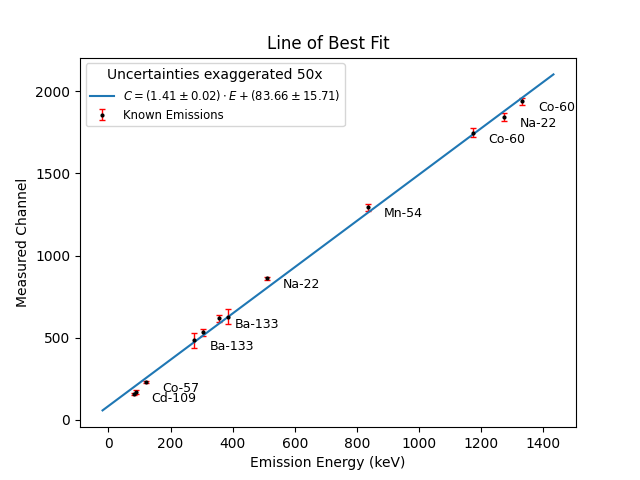
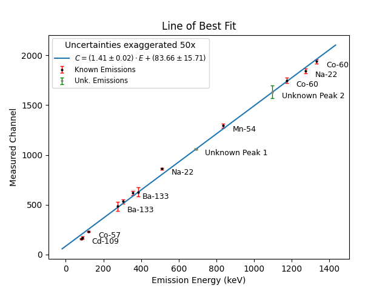

# Plotting the Known Data
As mentioned previously, the relationship between the mean channel numbers that we find and the actual emission energy levels should be a linear one. This means that we'll be using the equation of a line:

$$y=mx+b$$

We can now plot our data with the found channel numbers, C, as the y-axis, and the known emission energies, E, as the x-axis, giving us:

$$C=mE+b$$

We should now be able to take our data and fit it to a line with these parameters. After doing this, we should be able to simply plug the mean channel numbers for the peaks of our unknown source into this found equation and compare it to known emission peaks to discover what element it could be.

When we're done finding the peaks of all of our data, our `value_bank` should look like:
```python
value_bank = {
    ('Na-22', Na_22P1_mu, Na_22P1_mu_uncert, 511),
    ('Na-22', Na_22P2_mu, Na_22P2_mu_uncert, 1274.54),
    ('Mn-54', Mn_54P1_mu, Mn_54P1_mu_uncert, 834.84),
    ('Co-57', Co_57P1_mu, Co_57P1_mu_uncert, 122.06),
    ('Co-60', Co_60P1_mu, Co_60P1_mu_uncert, 1173.23),
    ('Co-60', Co_60P2_mu, Co_60P2_mu_uncert, 1332.49),
    ('Cd-109', Cd_109P1_mu, Cd_109P1_mu_uncert, 88.03),
    ('', Ba_133P1_mu, Ba_133P1_mu_uncert, 81),
    ('Ba-133', Ba_133P2_mu, Ba_133P2_mu_uncert, 276.4),
    ('', Ba_133P3_mu, Ba_133P3_mu_uncert, 302.85),
    ('Ba-133', Ba_133P4_mu, Ba_133P4_mu_uncert, 356.01),
    ('', Ba_133P5_mu, Ba_133P5_mu_uncert, 383.85),
} 
```
>NOTE: Only two of the Ba-133 peaks are labelled. This is because they are so close to themselves and other isotopes that their labels would overlap if kept.

In order to handle the known peaks separately from our unknown ones, we've also created a separate bank for the peaks from the unknown source:
```python
unknown_values = {
    ('Unknown Peak 1', unknown_P1_mu, unknown_P1_mu_uncert),
    ('Unknown Peak 2', unknown_P2_mu, unknown_P2_mu_uncert)
}
```
Now, to plot our known peaks, we'll create a `for loop` to go through `value_bank` and separate everything into their own arrays. We'll first initialize our arrays and then append the values into them with our loop. As the uncertainties are pretty small, we'll also want to amplify them so that they'll be visible when plotted. This should be fine as long as we note this exaggeration somewhere in our plot.
```python
uncertainty_scale = 50
labels             = []
tested_means       = []
tested_uncertainty = []
known_peaks        = []
for (label, tested, uncertainty, known) in value_bank:
    labels.append(label)
    tested_means.append(tested)
    tested_uncertainty.append(uncertainty * uncertainty_scale)
    known_peaks.append(known)
```
With our known_peaks and tested_means now separated, we can use `scipy`'s `linregress` to calculate the slope, intercept, and their respective margin's of error:
```python
result = linregress(known_peaks, tested_means)
slope         = result.slope
intercept     = result.intercept
stderr        = result.stderr
intercept_err = result.intercept_stderr
```
We can now plot our data so far to make sure our data makes sense. If you found the peak values separately and your results show significant deviation from these results, it's possible an error was made that you can now try to find and correct. 

For plotting the line of best fit, we'll first create a line which uses the calculated slope and intercept values along with `np.linspace`. We'll add some space on either side of our max and min values to give our data points some visual space. Then we can plot our error bars, display our labels for each data point, and plot our data, the line of best fit, and label our axes:
```python
x_line = np.linspace(min(known_peaks)-100, max(known_peaks)+100, 100)
y_line = slope*x_line + intercept

plt.errorbar(
    known_peaks, tested_means,
    yerr=tested_uncertainty,
    fmt='o', markersize=2, color='black',
    ecolor='red', elinewidth=1, capsize=2,
    label='Known Emissions'
)

for x, y, label in zip(known_peaks, tested_means, labels):
    plt.text(x+50, y, label, fontsize=9, ha='left', va='top')

plt.scatter(known_peaks, tested_means, s=1)
plt.plot(x_line, y_line, label=f'$C=({slope:.2f}\pm{stderr:.2f})\cdot E+({intercept:.2f}\pm {intercept_err:.2f})$')
plt.xlabel('Emission Energy (keV)')
plt.ylabel('Measured Channel')
plt.title('Line of Best Fit')
plt.legend(title=f'Uncertainties exaggerated {uncertainty_scale}x', fontsize='small')
plt.show()
```
**Output:**



# Plotting the Unknown Isotope
In order to find the emission energies for our unknown isotope, we'll have to rearrange our linear equation for E. As $C=mE+b$:

$$E = \frac{C-b}{m}$$

Now that we have our slope, m, and intercept, b, from using `linregress`, we can start finding our unknown energy values as well as their uncertainties. We're looking for the uncertainties in the unknown energy as it is possible that when we search gamma tables to try and find our isotope we may get multiple energy results **near** our central peak. To find the energy uncertainties, we'll have to use **error propagation**. 
## Error Propagation
For a given function:

$$f(x_1, x_2,...,x_n)$$

Where each variable $x_i$ has an uncertainty $\sigma_{x_i}$, the uncertainty in f, $\sigma_f$ can be found as:

$$\sigma_f = \sqrt{
    (\frac{\delta f}{\delta x_1}\sigma_{x_1}^2) + 
    (\frac{\delta f}{\delta x_2}\sigma_{x_2}^2) + ... + 
    (\frac{\delta f}{\delta x_n}\sigma_{x_n}^2)
}$$

As we're looking for $\sigma_E$, this means our equation will look like:

$$\sigma_E = \sqrt{(\frac{\delta E}{\delta C}\sigma_C)^2+(\frac{\delta E}{\delta b}\sigma_b)^2+(\frac{\delta E}{\delta m}\sigma_m)^2}$$

$$\sigma_E = \sqrt{
    (\frac{1}{m}\sigma_C)^2 + 
    (-\frac{1}{m}\sigma_b)^2 +
    (-\frac{C-b}{m^2}\sigma_m)^2
}$$

We can now use all of this information to include our unknown isotopes in the plot as well as return the possible emission energy ranges. First, we'll want to create our new arrays for the labels, the means and uncertainties, and their associated energy values. We can also print out our energy values so that we can later compare the ranges to gamma tables:
```python
unknown_labels        = []
unknown_means         = []
unknown_uncertainties = []
predicted_energies    = []
predicted_uncertainty = []

unknown_values = {
    ('Unknown Peak 1', unknown_P1_mu, unknown_P1_mu_uncert),
    ('Unknown Peak 2', unknown_P2_mu, unknown_P2_mu_uncert)
}
for label, tested, uncertainty in unknown_values:
    unknown_labels.append(label)
    unknown_means.append(tested)
    unknown_uncertainties.append(uncertainty)

    # Convert to energy
    energy = (tested - intercept) /slope
    energy_uncertainty = np.sqrt(
        ((uncertainty/slope)**2) +
        ((-intercept_err/slope)**2) +
        ((-(tested-intercept)*stderr/(slope**2))**2)
    )
    predicted_energies.append(energy)
    predicted_uncertainty.append(energy_uncertainty)
    print(f'{label}: {energy:.2f} keV +/- {energy_uncertainty:.2f} keV')
    print(f'({energy-energy_uncertainty:.2f} keV to {energy+energy_uncertainty:.2f} keV)')
```
**Output:**
```python
Unknown Peak 1: 690.28 keV +/- 15.45 keV
(674.83 keV to 705.73 keV)
Unknown Peak 2: 1097.36 keV +/- 20.35 keV
(1077.00 keV to 1117.71 keV)
```
As we needed the non-exaggerated uncertainties to accurately calculate the energy ranges, we'll exaggerate them elsewhere and use that new array for plotting. Let's go ahead and plot our error bars and add these data points to our plot:
```python
exagg_unk = [u * uncertainty_scale for u in unknown_uncertainties]

plt.errorbar(
    predicted_energies, unknown_means,
    yerr=exagg_unk,
    fmt='o', markersize=2, color='grey',
    ecolor='green', elinewidth=1, capsize=2,
    label='Unk. Emissions'
)
for x, y, label in zip(known_peaks, tested_means, labels):
    plt.text(x+50, y, label, fontsize=9, ha='left', va='top')
for x, y, label in zip(predicted_energies, unknown_means, unknown_labels):
    plt.text(x+50, y, label, fontsize=9, ha='left', va='top')
plt.scatter(known_peaks, tested_means, s=1)
plt.scatter(predicted_energies, unknown_means, s=1)
plt.plot(x_line, y_line, label=f'$C=({slope:.2f}\pm{stderr:.2f})\cdot E+({intercept:.2f}\pm {intercept_err:.2f})$')
plt.xlabel('Emission Energy (keV)')
plt.ylabel('Measured Channel')
plt.title('Line of Best Fit')
plt.legend(title=f'Uncertainties exaggerated {uncertainty_scale}x', fontsize='small')
plt.show()
```
**Output:**



# Finding Matching Isotopes
An important thing to note when trying to find which isotopes our unknown source could potentially be, is that we've **never** specified that the source contains **only one** isotope. It's entirely possible that it has two isotopes that have our observed peaks instead. 

In searching for our source, we'll be using the website [https://atom.kaeri.re.kr/old/gamrays.html](https://atom.kaeri.re.kr/old/gamrays.html). Here, we can enter our energy range as well as a half-life, and receive an output of multiple isotopes. As the sources had not been changed in multiple years at UCDenver, we can estimate a half-life of at least a month.

Using this tool, our found energy ranges, and an estimated half-life minimum of 30 days, the matches we find for our first peak are:

|Nuclide | Energy (keV) |
|--------|--------------|
|Te-129  |695.88        |
|Pm-144  |696.49        |
|Nb-94   |702.622       |

And for our second peak, we get the matches:

|Nuclide | Energy (keV) |
|--------|--------------|
|Sn-123  |1088.64       |
|Fe-59   |1099.25       |
|Te-121  |1102.15       |
|Zn-65   |1115.55       |

As this information provides us with no overlapping options, this means that we will have to compare each of the first three options against each of the last four options in order to determine which combination of isotopes our source contained.

---

In order to perform this final analysis, we'll need to perform something known as a $\chi^2$ (or **chi-squared**) fit. [Click here to continue on to our next section](07_chi_squared.md) where we will learn how to use such fits to find the quality of our data fits.